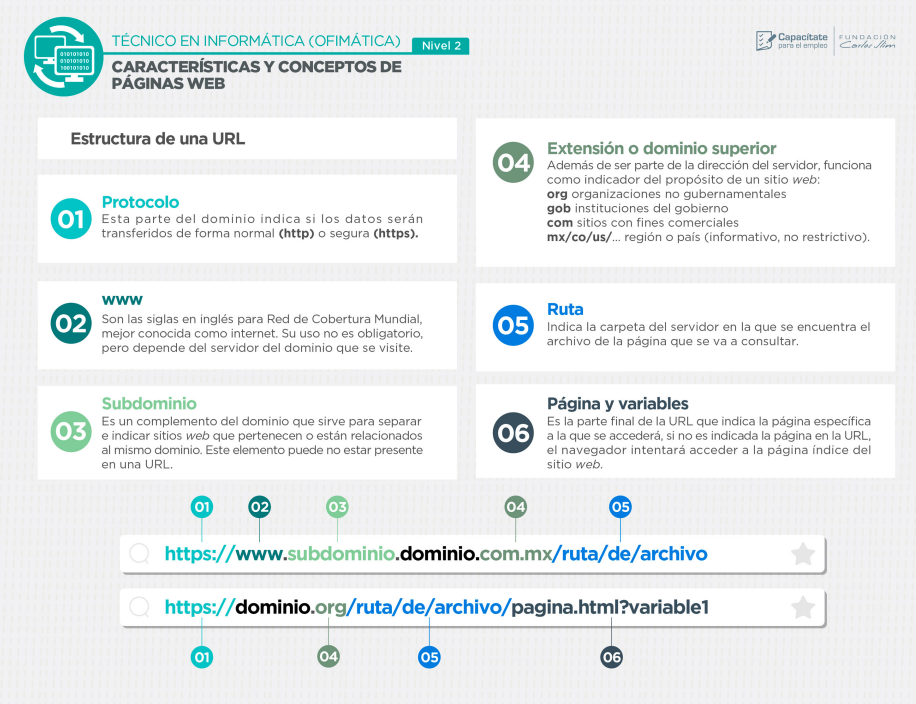
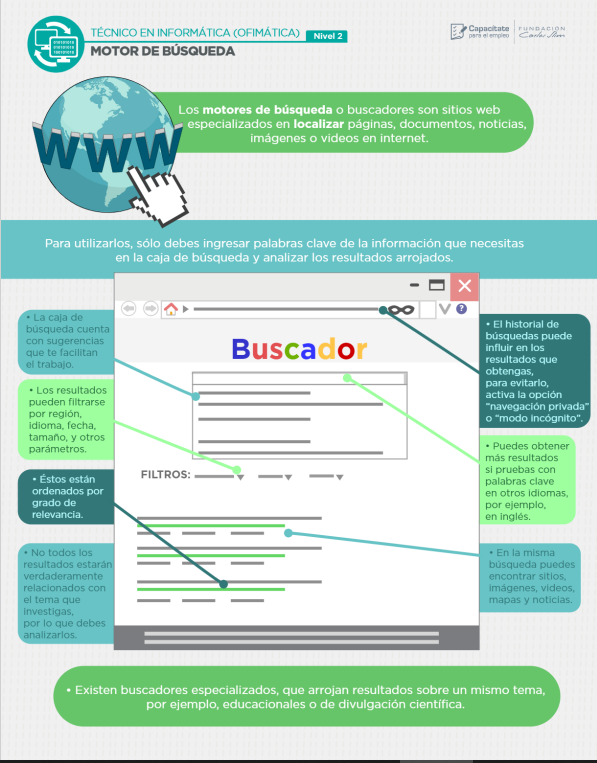

## tecnico en informatica
### leccion 1' (NIVEL 1)
<!-- infografias leccion 1-->

<!-- de lo que trata -->

###### las infografias nos hablan sobre la partes del cpu y su funcionamiento tambien los diferentes dispositivos de los puertos y perifericos y en la ultima hablamos de los diferentes tipos de PC y su funcionamiento

<!-- infografias leccion 2-->
### leccion 2

<!-- de lo que trata -->

######  en la leccion 2 infografia uno se mostro las funciones y como se usan los teclados y mauses/raton/puntero con su respectivo ejemplo,en la segunda se mostro como se pueden instalar progrmas desde sitios web o tiendas dentro del sistema operativo, en las ultimas tres podemos decir que se nos iso saber como se usan los diferentes usos de la pantalla y funciones del menu contextual y del menu de inicio
<!-- infografias leccion 3-->
### LECCION 3

<!-- de lo que trata -->

###### en estas tres infografias hablan sobre kas funciones principales de la internet tanto como conectarse hasta ponerlo en una red analambrica  y los conceptos basicos de la internet  
<!--esto conforma al nivel 1-->

## NIVEL 2

### LECCION 1 

<!-- de lo que trata -->

###### de las infografias mostradas se puede decir como usar el buen funcionamiento de las paginas que nos ayudan a buscar informarcion o crear cuentas de usuario  y como tener de estos una mayor seguridad al momento de identificarlos por sus organizaciones u otras cosas de suma importancia y finalmete de como no pasar informacion delicada como una cuenta bancaria 

